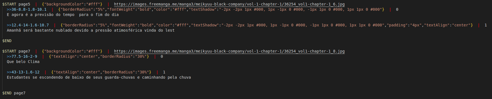
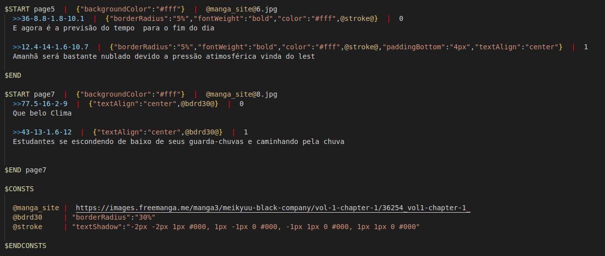

# Format \ *. Psrt

This is a caption for comics (manga) images. It was created to facilitate the translations of the comics

## Pattern

All positions in the texts of the .psrt file are in percentages in relation to the image measurements
`>>` `<X>%` -` <Y>% `-` <Width>%` -` <TextSize>% `

### Pages

```

$ START <page-name> | <page-style> | <image-url>
    >> <X> - <Y> - <Width> - <TextSize> | <style-text> | index
    text 1!

    >> <X> - <Y> - <Width> - <TextSize> | <style-text> | index
    text 1!
$ END <page-name>

```

example:
! [alternative text] (assets / psrt_expample_1.png "Title")

### Sources

```

$ FONTS
  <font-url-1>
  <font-url-2>
$ ENDFONTS

```

example:
! [alternative text] (assets / psrt_expample_2.png "Title")

### Constants

```

$ START <page-name> | <page-style> | <const-name-1> 3.jpg
    >> <X> - <Y> - <Width> - <TextSize> | <style-text> | index
    text 1!

    >> <X> - <Y> - <Width> - <TextSize> | <style-text> | index
    text 1!
$ END <page-name>

$ CONSTS
  @ <const-name-1> | <const-value-1>
  @ <const-name-2> | <const-value-2>
$ ENDCONSTS

```

example:
No constants


With constants
